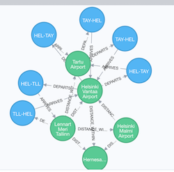

# Aiport route API                                        #                   

## Description

Sample HTTP API for flight route search based on neo4j.



## Development

With docker:

		$ docker-compose up

Run it with local node.js:

		$ docker run --publish=7474:7474 --publish=7687:7687 --env NEO4J_AUTH=none -v $PWD/import:/var/lib/neo4j/import -v $PWD/data:/data -v $PWD/logs:/logs neo4j

		$ export NEO4J_HOST=localhost && npm run start

Neo4j browser is here: http://localhost:7474/browser/

Call the HTTP API:

		$ curl "http://localhost:3000/routes?from=TLL&to=TAY"		

Possible routes are sorted by total distance.

Sample response:

```json
{
  "routes": [
    {
      "segments": [
        {
          "type": "FLIGHT",
          "origin": "TLL",
          "destination": "HEL",
          "distance": 100885.66230018
        },
        {
          "type": "FLIGHT",
          "origin": "HEL",
          "destination": "TAY",
          "distance": 244270.39073097
        }
      ],
      "totalDistance": 345156.05303115
    },
    {
      "segments": [
        {
          "type": "FLIGHT",
          "origin": "TLL",
          "destination": "HEL",
          "distance": 100885.66230018
        },
        {
          "type": "FLIGHT",
          "origin": "HEL",
          "destination": "TAY",
          "distance": 244270.39073097
        }
      ],
      "totalDistance": 345156.05303115
    },
    {
      "segments": [
        {
          "type": "ALTERNATIVE",
          "origin": "TLL",
          "destination": "HEN",
          "distance": 81922.767905472
        },
        {
          "type": "ALTERNATIVE",
          "origin": "HEN",
          "destination": "HEL",
          "distance": 18981.858630461
        },
        {
          "type": "FLIGHT",
          "origin": "HEL",
          "destination": "TAY",
          "distance": 244270.39073097
        }
      ],
      "totalDistance": 345175.0172669
    },
    {
      "segments": [
        {
          "type": "ALTERNATIVE",
          "origin": "TLL",
          "destination": "HEN",
          "distance": 81922.767905472
        },
        {
          "type": "ALTERNATIVE",
          "origin": "HEN",
          "destination": "HEL",
          "distance": 18981.858630461
        },
        {
          "type": "FLIGHT",
          "origin": "HEL",
          "destination": "TAY",
          "distance": 244270.39073097
        }
      ],
      "totalDistance": 345175.0172669
    },
    {
      "segments": [
        {
          "type": "ALTERNATIVE",
          "origin": "TLL",
          "destination": "HEM",
          "distance": 94386.935666986
        },
        {
          "type": "ALTERNATIVE",
          "origin": "HEM",
          "destination": "HEL",
          "distance": 8234.2516641968
        },
        {
          "type": "FLIGHT",
          "origin": "HEL",
          "destination": "TAY",
          "distance": 244270.39073097
        }
      ],
      "totalDistance": 346891.57806215
    },
    {
      "segments": [
        {
          "type": "ALTERNATIVE",
          "origin": "TLL",
          "destination": "HEM",
          "distance": 94386.935666986
        },
        {
          "type": "ALTERNATIVE",
          "origin": "HEM",
          "destination": "HEL",
          "distance": 8234.2516641968
        },
        {
          "type": "FLIGHT",
          "origin": "HEL",
          "destination": "TAY",
          "distance": 244270.39073097
        }
      ],
      "totalDistance": 346891.57806215
    }
  ]
}
```

## Data

Data downloaded from [openflight.org](https://openflights.org/data.html)

### Airports

Fetch airport data:

		$ curl https://raw.githubusercontent.com/jpatokal/openflights/master/data/airports.dat --output import/airports.dat

Some insights about the data:

		$ wc -l import/airports.dat 

		7184 data/airports.dat

		$ head -n 2 import/airports.dat

		1,"Goroka Airport","Goroka","Papua New Guinea","GKA","AYGA",-6.081689834590001,145.391998291,5282,10,"U","Pacific/Port_Moresby","airport","OurAirports"
		2,"Madang Airport","Madang","Papua New Guinea","MAG","AYMD",-5.20707988739,145.789001465,20,10,"U","Pacific/Port_Moresby","airport","OurAirports"

Each entry contains the following information:

Airport ID, Name, City, Country, IATA, ICAO, Latitude, Longitude, Altitude, Timezone, DST Daylight savings time, Tz database time zone, Type, Source

### Routes

Fetch routes data:

		$ curl https://raw.githubusercontent.com/jpatokal/openflights/master/data/routes.dat --output import/routes.dat

		$ wc -l data/routes.dat 
   		67663 import/routes.dat

		$ head data/routes.dat 
		2B,410,AER,2965,KZN,2990,,0,CR2

### Distances

Calculate distances:

		$ npm run paths


## Additional links

[Neo4j match clause](https://neo4j.com/docs/developer-manual/current/cypher/clauses/match/)

[Neo4j spatial functions](https://neo4j.com/docs/developer-manual/current/cypher/functions/spatial/)

[openflight.org](https://openflights.org/data.html)


                                                                                                                                         

